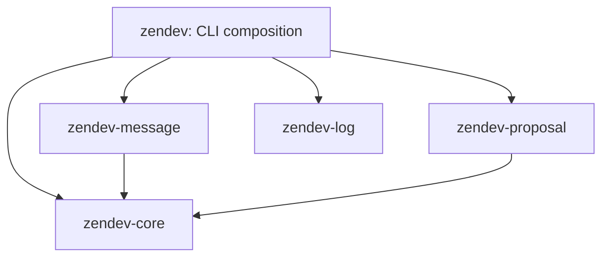

# Architecture



Core owns configuration discovery, diagnostic rendering, operation-scoped source
snapshots and shared Markdown facts. It knows neither domain policy nor CLI/Git.
Domain loaders interpret their own tables from one discovered source.

Message exposes pure `parse_message`, `check_message`, `check_git_message`,
`render_message` and `check_body` functions. Parsing supplies structure; the
ZenDev policy checks type/intention pairs. Interactive, CLI, hook and Action
adapters read inputs and display the same diagnostics.

Proposal separates repository parsing, document shape, content, relationships,
history and index projection. Indexing depends on relationship validation;
validation does not import indexing. `application.py` owns the workflow:

```text
source snapshot → parse → validate → candidate repairs → validate → ChangePlan
                                                                     ↓
                                                    apply_plan → transaction
```

A plan records configuration, schemas (including discovered local references),
templates, proposals and observed linked files. Reads and Markdown facts are
cached only for that operation. Applying a plan verifies its input bytes and
absence observations again, prepares replacements and backups, then writes
through one rollback-capable boundary. A changed input aborts the write. A
requested history ref resolves to a commit before planning. Repair diagnostics
come from source positions rather than parsing human-readable error messages.

`--partial` permits only the existing independently safe repair contract; it
retains remaining diagnostics and withholds an invalid index. `--diff` never
writes. Repository configuration, JSON schemas and templates still own policy.

`just check` and `just ci` do not format source files; `just format` is explicit.
`just packages` builds wheels, checks version pins and namespace ownership, and
exercises five isolated installations outside the checkout.

[Hatch metadata hooks](https://hatch.pypa.io/latest/plugins/metadata-hook/reference/)
resolve sibling pins from the VCS version. Component builds reference the same root hook file from the complete repository
checkout. Releases publish independently installable wheels. Release ordering is core/log, then message/proposal, then
the CLI distribution. New PyPI projects and trusted publishers must be configured
before the first release; changing CI does not create those hosted resources.

`README.md` and package READMEs are landing pages. `docs/` owns usage guides;
`zfps/` owns public design and governance decisions.
